# Docker Commands
## docker ps
### - shows running containers
## docker ps --all
### - shows all containers (running and stopped)
## docker run [image] 
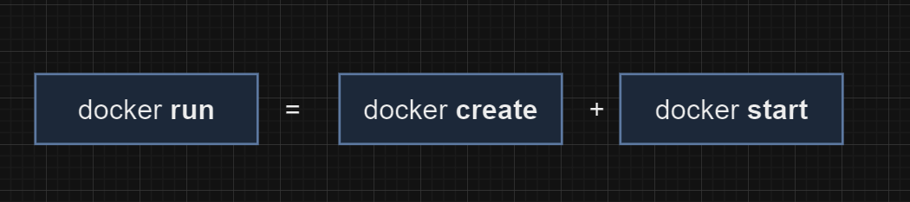
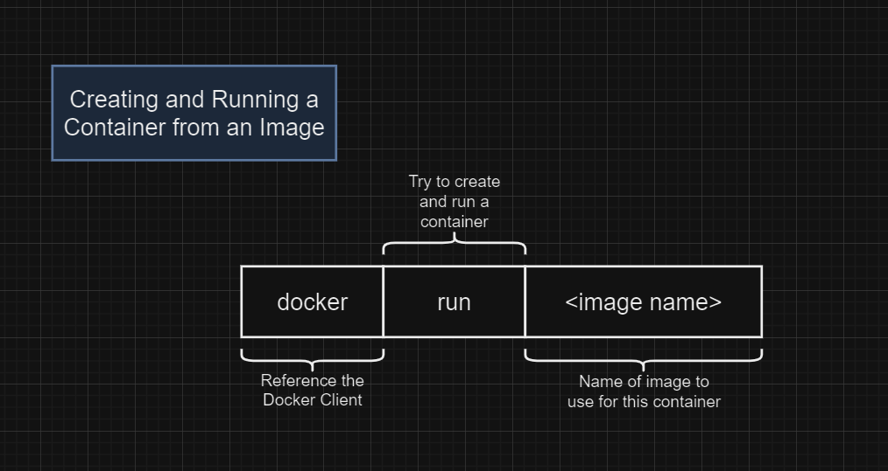

## docker run [image] command
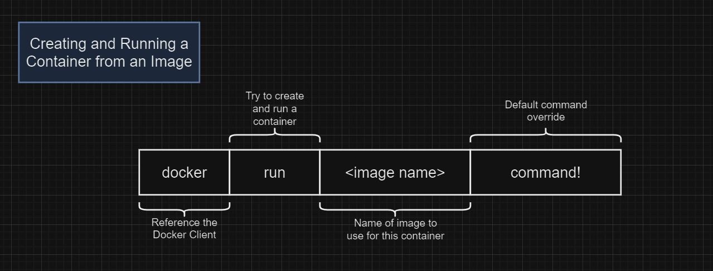
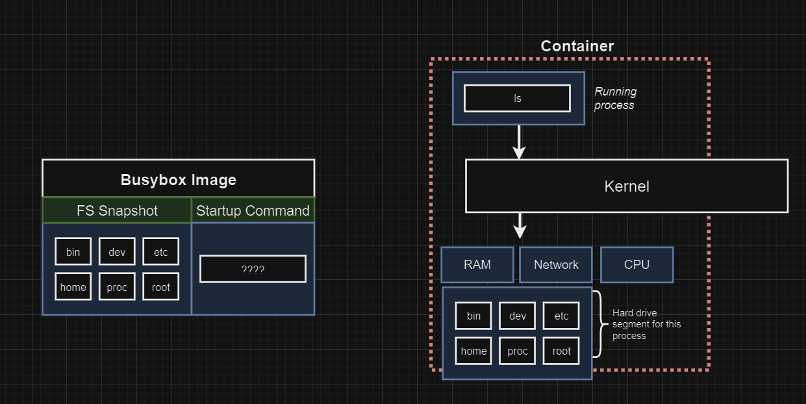
## docker run -p 8080:8080 [image] command
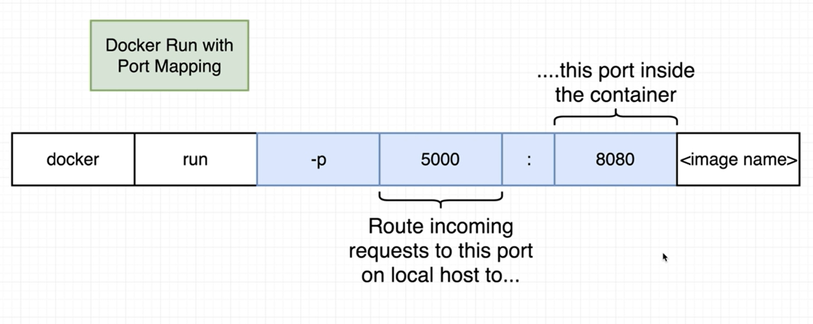
## docker create [image]

## docker start [container id]
### - starts the container
### - does not wait for output 
### - works on stopped containers also

## docker start -a [container id]
### - waits for output (shows in terminal)

## docker system prune
### deletes:
### - all stoped containers build cache 
### - all networks not used by at least one container
### - all dangling images
### - all build cache

## docker logs [container id]
- returns all of the logs from the container
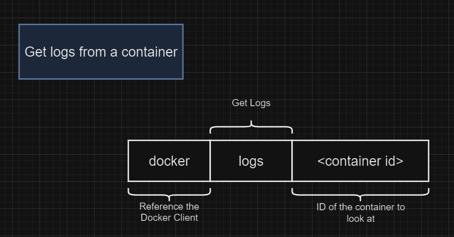

## docker stop [container id]
### - takes a couple of seconds to shutdown
### - does a litte bit of cleanup
### - if it takes more than 10 seconds to shutdown, docker autoamtically executes the kill command 
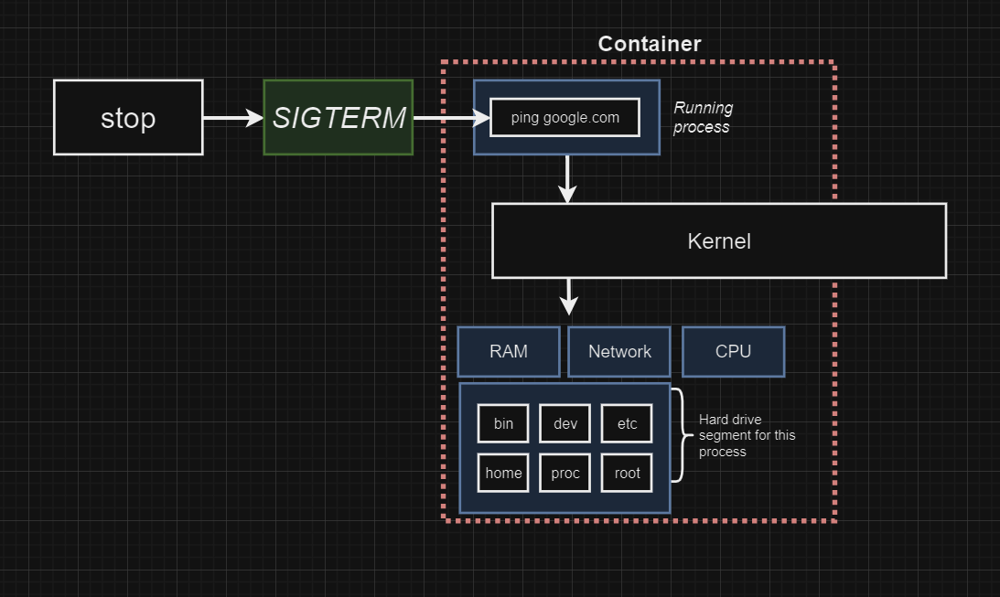

## docker kill [container id]
### - shutdowns the container immediately
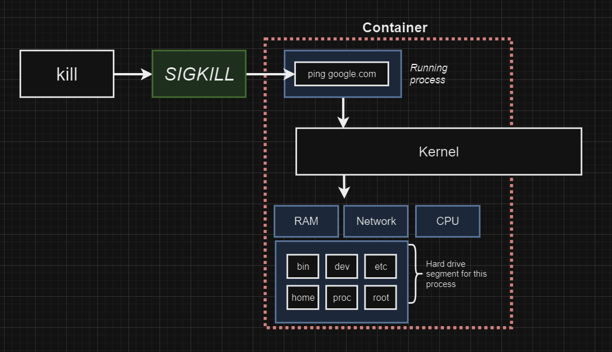

## docker exec -it [container id] [command]
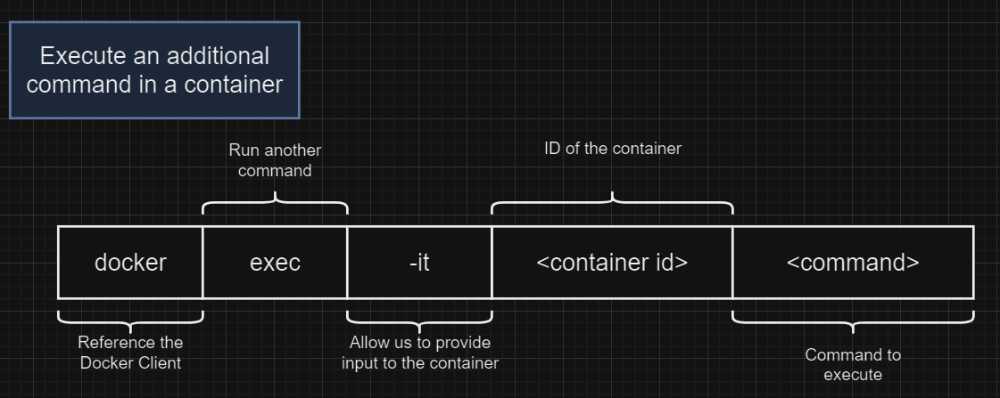
### -> -i the input is directed to the STDIN of the contianer
### -> -t makes the text nicely formatted 
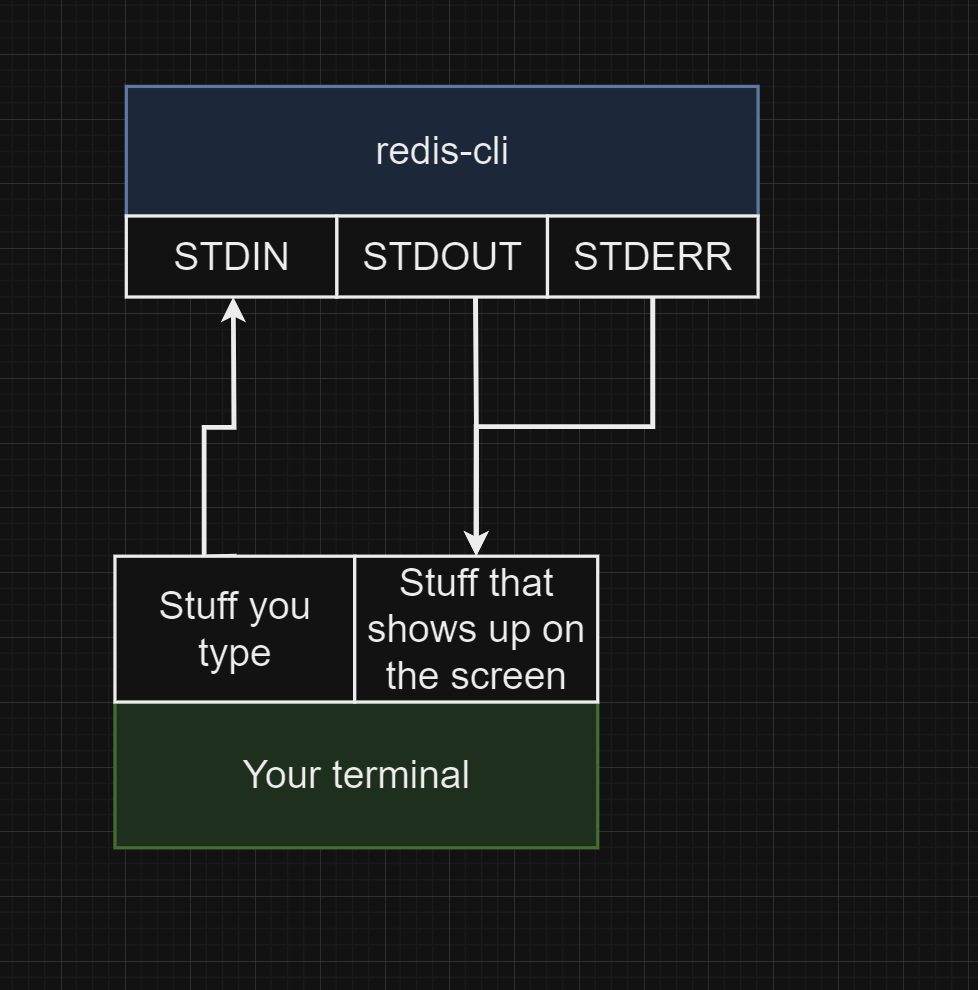

# docker exec -it [container id] sh
### - creates an interactive shell (full terminal access)
### - sh is a program that gets executed in the container
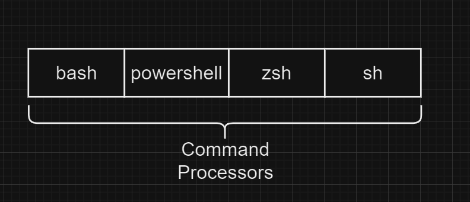
### alternative for this is <b>docker run -it [image] sh </b>(but it does not run a process on startup) 