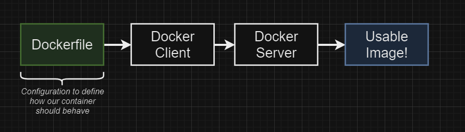
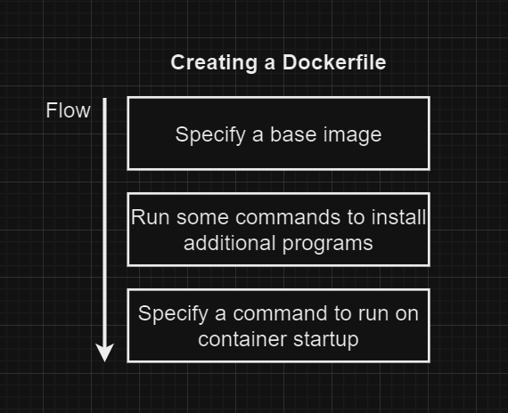

# Docker Images
## Creating Docker Images

## docker build .
### - builds an image based on the Dockerfile in the same directory 
## Buildkit
### - It will hide away much of its progress which is something the legacy builder did not do
### - To see this output, you will want to pass the progress flag to the build command
### <b>docker build --progress=plain .</b>