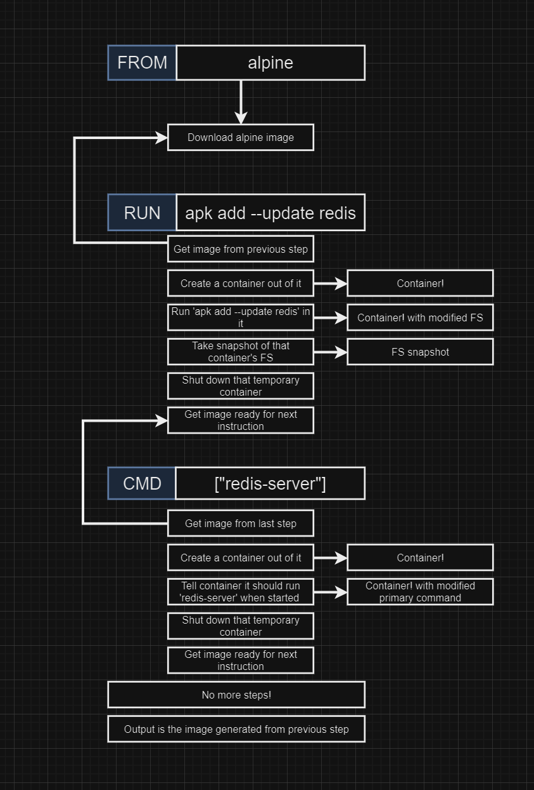
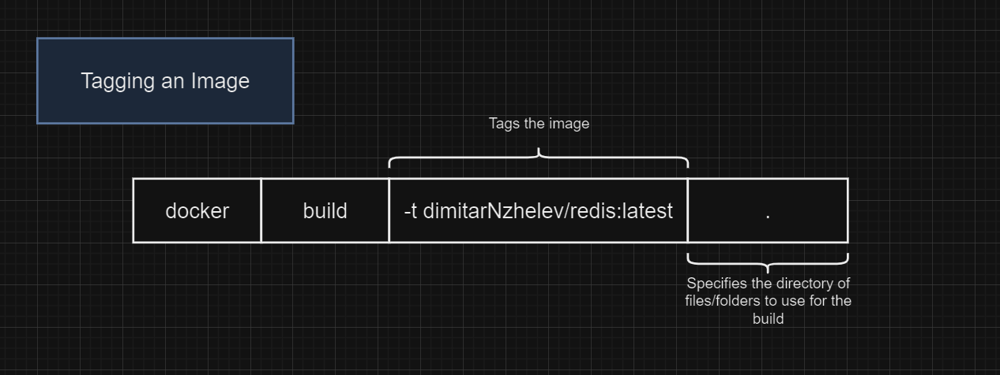
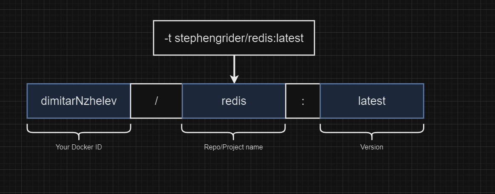
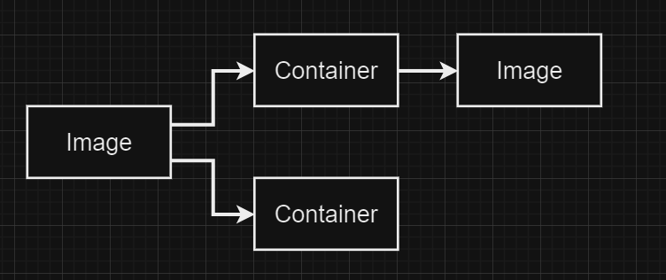

# Docker Images
## Creating Docker Images

## docker build .
### - builds an image based on the Dockerfile in the same directory 
## Buildkit
### - It will hide away much of its progress which is something the legacy builder did not do
### - To see this output, you will want to pass the progress flag to the build command
### <b>docker build --progress=plain .</b>
## docker build in detail

## tagging an image

### - you do not have to specify the version while running the container
### <b>docker run dimitarNzhelev/redis</b>
## docker commit
### - generates an image from a container

### on Linux/Mac <b>docker commit -c 'CMD ["redis-server"]' CONTAINERID</b>
### on Windows <b>docker commit -c "CMD 'redis-server'" CONTAINERID</b>