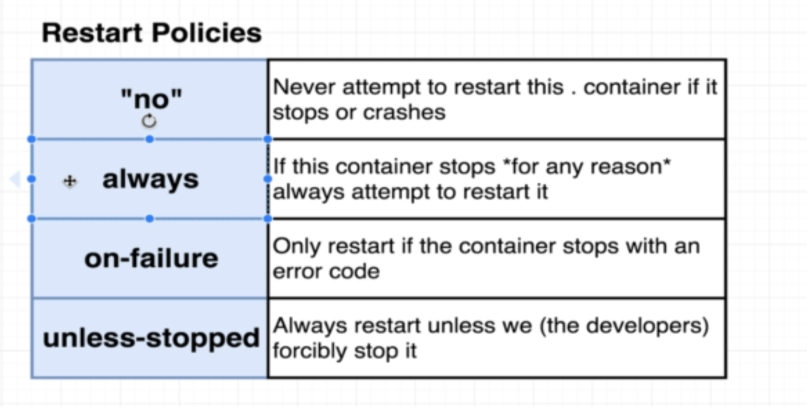

# Docker Compose

## docker-compose up

## docker-compose up -d

### - launches the containers in the background (you can continue running commands in the same terminal)

## docker-compose down

### - stops the containers

## Restart policies

## docker-compose ps

### - same as docker ps, but for docker-compose

### - finds the running containers bellonging to the docker-compose.yml file from the same directory

## A really good resources are this two youtube videos

<b>
<a href="https://www.youtube.com/watch?v=YFl2mCHdv24&ab_channel=JakeWright">Docker Video</a>

<a href="https://youtu.be/Qw9zlE3t8Ko?si=lbIB1N1hFQ8dbcsz">Docker Compose Video</a>
</b>
